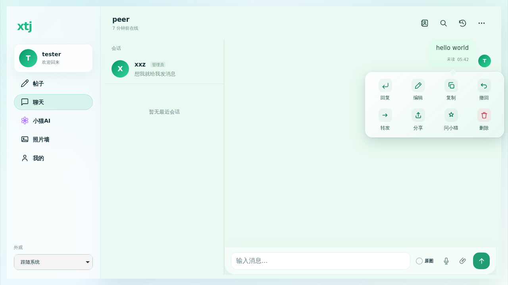
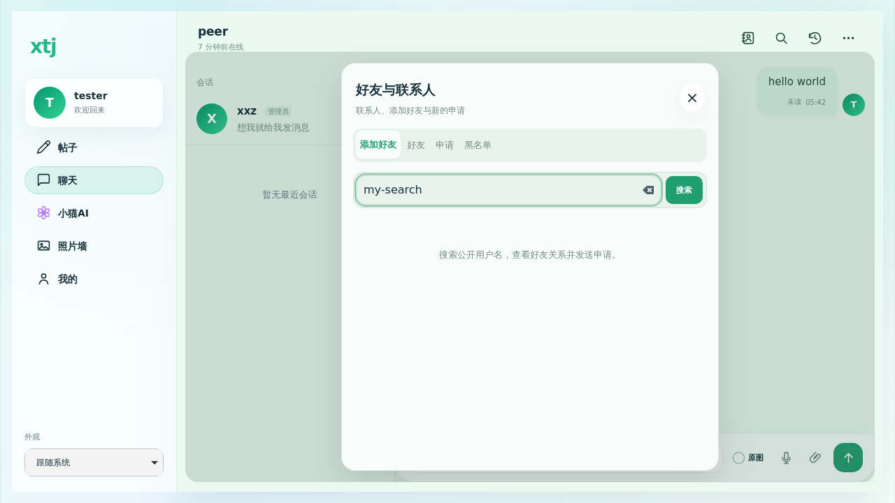
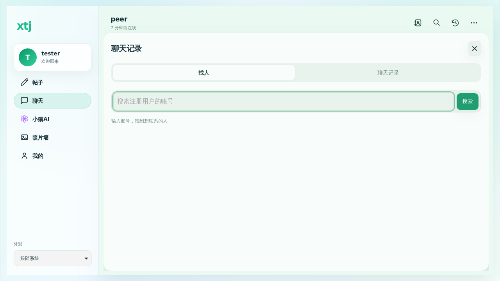

# 聊天交互修复与扩展 · 2026-09-30

基于 main `54569a01`。本轮不增加收藏；底部 Dock DOM 与基线逐项比较相同（415 个解析事件），未修改 Dock 样式或导航逻辑。

## 已实现

- 首页导航回到普通滚动流，随帖子滑出屏幕。恢复月亮图标，并保留主题开关过渡、减少动画偏好。
- 搜索默认找注册账号，聊天记录排第二；重新整理分段按钮、查询与筛选。联系人提供稳定容器和按账号、标签、申请方向的节点缓存，切换不销毁搜索输入。
- 长按菜单使用四列两排，不横向隐藏操作；移除回应、转文字入口，增加回复回车箭头。限制长按补发点击的屏蔽对象与时长，操作后清除，避免吞掉后续播放和引用点击。
- 回复引用可点，后端分页获取原消息上下文；验证兼容规范化和旧消息 ID，并维持隐藏及会话权限校验。这是兼容修正，并非线上已确认 ID 不一致的故障。
- 清空后的空数组缓存保留；打开详情不用伪消息骨架占满空会话，读取后台数据时保留当前视图。
- 语音发送首帧即为波纹气泡，使用录制文件 object URL，携带时长；成功确认继续使用可播放本地资源，避免短暂退回文本。恢复播放音频会话、取消静音、刷新过期签名并明确提示重试。MP4 编码优先；不再与浏览器识别器争用录音麦克风，自动转写交由已有服务端队列。
- 支持每批最多 9 个附件、总计 200MB，可排序及移除，依次上传，每条失败保留已有重试入口；切换账号或会话停止剩余上传。
- 手机右滑回复，竖向滑动继续滚动；键盘开合保持阅读位置，仅用户原本在末尾时跟随最新消息，增加收到消息数量提示。
- 聊天图库提供前后切换、日期、保存、原消息定位、图内缩放；从后端图片索引按需分页，关闭或退出释放监听。
- 新增显式开启的系统 Web Push：加密投递、默认隐藏内容、尊重免打扰、过期订阅清理、退出账号隔离、当前可见聊天抑制重复通知。数据库订阅表两条迁移已应用，RLS 与浏览器禁读写已核对；新增表未被安全 advisor 标记。签名密钥独立域派生，不增加前端密钥。

## 验证

完整 Node 回归 847/847，补充检查 99/99；Chromium 30/30。WebKit 29 项通过，实际 MediaRecorder 编码测试因云端 Linux 引擎无此 API 跳过；真实 WAV 播放及模拟麦克风录音生命周期仍在两引擎覆盖。Chromium 实际 MediaRecorder 输出解码验证音频 RMS 与时长，不以文字或伪 Blob 当作录音通过。

生产 JS/CSS 已重建，语法、源码与 HTML 资源指纹一致性检查通过。完整跨引擎测试包含菜单两排、长按后回复引用、触摸滑动回复、多图顺序、图库按需分页、清空聊天、账号搜索默认顺序和联系人输入节点保留。

尚需物理 iPhone/iPad Safari 麦克风、系统键盘与硬件流畅度验收；云端引擎不替代真机。系统服务关闭页面后的实际外部 Push 投递和转写提供商调用也不能用单元测试代替，部署后另行核对可用能力。

