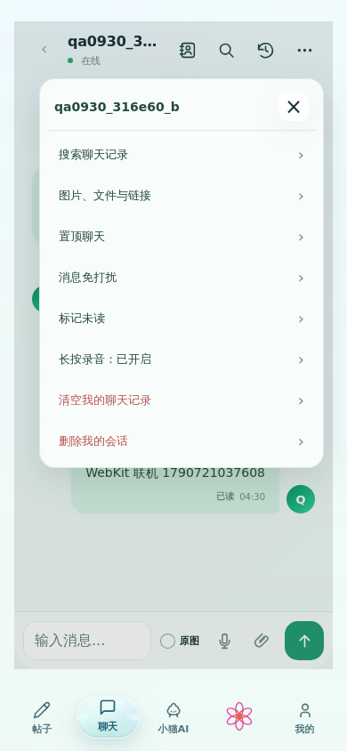
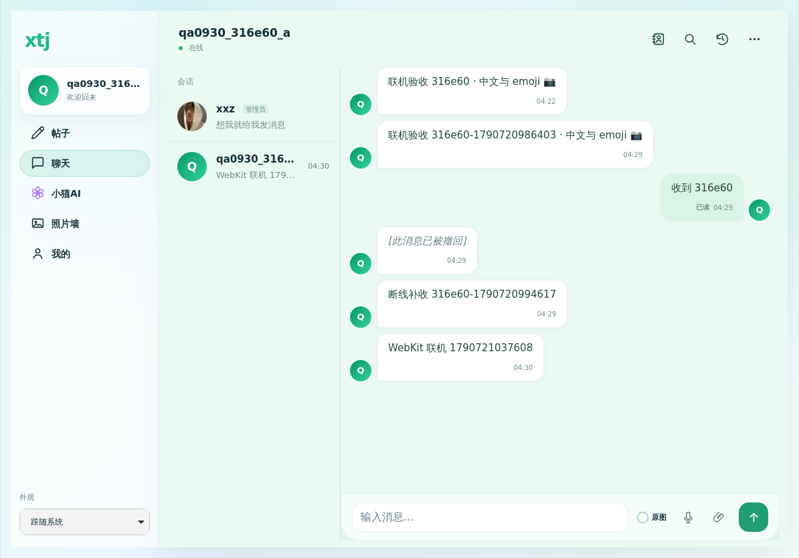

# 聊天线上联机验收 · 2026-09-30

在 `https://xtj.onrender.com` 使用本轮创建的两个临时账号、独立浏览器会话验收。Chromium 与 WebKit 联机验收运行于提交 `1355ea9e`；退出修复及复测运行于 `eb44ddb7`。两个版本的 `/health` 均确认数据库正常。

## 结果

| 验收 | 结果 | 范围 |
| --- | --- | --- |
| Chromium 线上联机 | 16/16，浏览器错误 0 | 真实登录、好友申请与接受、在线状态、订阅建立、输入及停止输入、双向文本、已读、菜单、手机尺寸、私有图片上传与解码、断网后恢复补收、撤回测试附件 |
| WebKit 线上联机 | 8/8，浏览器错误 0 | 两个真实账号登录、输入状态、消息与已读同步、手机和平板无横向溢出、触摸菜单开关、好友列表、注册账号搜索 |
| 本地 Chromium / WebKit | 各 23/23 | 聊天搜索与媒体、菜单、布局、真实 WAV 播放暂停、录音边界、会话节点保留等；最终暂停图标修改另在两引擎各复测 1 项通过 |
| 完整 Node 回归 | 842/842 + 99/99 | 包含实时可见消息已读上报、延迟客户端订阅恢复及撤销令牌数据库写入失败行为 |
| 生产资源 | 通过 | 已重建压缩 JS/CSS；语法检查、源码指纹及 HTML 资源指纹一致性检查通过 |
| 退出令牌 | 6/6 | 生产退出返回成功；本轮全部已知访问令牌随后访问受保护聊天接口均被拒绝 |

这些是两个真实账号之间的实际服务、数据库与实时网络测试，浏览器会话运行在云端。WebKit 使用触摸手机和平板视口，不能替代真实 iPhone/iPad Safari 的系统键盘、物理麦克风、功耗或硬件性能验收。录音自动化覆盖模拟麦克风流，真实 WAV 播放使用实际媒体引擎。

## 实际发现并修复的问题

- 登录恢复早于客户端初始化时，运行时配置恢复后没有建立聊天订阅。客户端创建成功后现在补建订阅。
- 用户正在查看会话时，实时到达的消息没有上报已读。现在只对当前可见聊天的新收到消息上报，其他会话、后台页面和自己的消息不会误报。
- 退出时撤销记录没有填写数据库必填的 `actor_key`，导致 503。现在保存仅含令牌哈希的键，数据库失败仍返回失败，防止只在内存中撤销；线上退出和拒绝旧令牌已复测。

## 清理

测试图片先通过本人撤回接口删除，存储对象核对为 0。清理事务严格限定本轮两个账号及其 UUID，并要求其会话没有其他参与者、没有存活附件或存储对象。事务后账号、posts、上传登记、成员关系和附件均为 0。测试凭据和浏览器会话文件已删除；保留撤销记录直到令牌到期，避免清理后恢复其效力。

机器结果保存在同名目录中的 `chromium-report.json`、`webkit-report.json`、`logout-report.json` 和 `cleanup-report.json`，均不包含密码、访问令牌或 Cookie。

