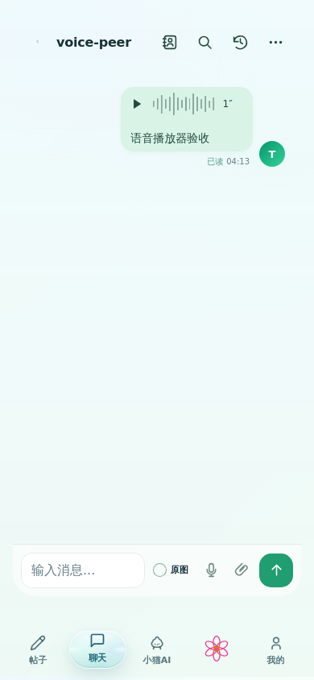
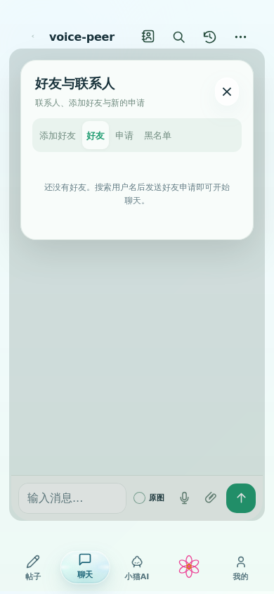
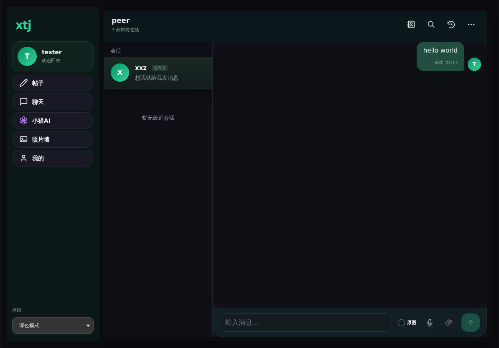

# 聊天与移动端比例优化 · 2026-09-30

本轮按用户提供的 iPhone 首页、iPad 聊天及输入框截图修改。底部 Dock 的 HTML 完整子树与修改前逐字一致；没有改其结构、尺寸、背景或动画。

## 完成的行为

- 首页顶部导航保持稳定的 sticky 位置，删除根据滚动方向隐藏、显示的逻辑；手机图标与账号胶囊统一放在一行。
- 手机和 iPad 使用实际可见区域；平板不再继承手机 Dock 的底部预留，聊天容器不再同时叠加固定 `dvh` 高度与预留。
- 移动端 viewport 限制页面缩放，Safari 手势监听防止误触页面缩放；照片预览继续使用自己的图片手势。输入框保留 16px 字号避免聚焦自动放大。浏览器自身的辅助缩放属于系统控制，不能宣称所有系统场景均已禁止。
- 输入控件与容器共享背景，消除深色模式下输入框两边的绿色色块。
- 联系人图标移到顶部搜索左侧，默认打开好友列表；添加好友、申请、黑名单集中于联系人面板。常用聊天按钮常显，资料、共同好友、备注、删除和拉黑收在明确展开的设置中。
- 顶部搜索可切换聊天记录与注册用户账号；账号搜索沿用后端受保护用户目录，不暴露邮箱或私人资料。消息搜索仍由后端分页、日期与类型筛选。
- 聊天记录与附件改用历史时钟图标。归档入口、会话菜单归档操作被移除；已有归档会话重新显示在普通列表，记录不会丢失。保留后端历史字段与兼容 API，避免破坏已保存数据。
- 语音消息使用播放按钮、波纹、时长与真实媒体播放事件；支持播放、暂停、结束与失败重试反馈，同一时间只播放一条。波纹只是播放提示，不冒充真实声学波形。
- 麦克风按钮在准备、录制和结束时保留图标，点击会请求系统麦克风。空白输入框长按 450ms 开始录音、松开发送、上滑超过 65px 取消；短按仍进入文字输入。会话设置可关闭长按录音。录音不足 600ms 不发送；权限请求过程中松手会取消，并释放随后返回的麦克风流。
- 切换会话/账号、隐藏页面和取消时终止录音。已输入文字与待发送附件不触发长按录音。
- 最近 6 个会话按当前账号保存有界 DOM 快照；消息更新按顺序就地插入，已读更新只修改元信息，保留已加载头像、图片与音频节点。清空、删除与退出账号同时失效缓存。
- 本地发送过渡缩短为 290ms，仅使用 transform/opacity，取消轮询和回包重播，以及飞行动画期间重复滚动。系统和站点减少动态效果设置仍有效。
- 实际线上联机发现登录恢复早于 Supabase 运行时配置，客户端建立后没有聊天订阅。新增配置自愈完成后的订阅恢复，并用独立运行测试覆盖。另补上正在查看会话时收到实时新消息的已读上报，后台页面与其他会话不会误报已读。

## 运行验证

- Chromium：23/23 聊天浏览器测试通过。
- WebKit：23/23 聊天浏览器测试通过，含手机和平板尺寸、真实 WAV 媒体播放/暂停、导航滚动、账号搜索、会话节点保留及长按录音边界。
- 完整 Node 回归与补充测试、语法及生产资源一致性检查通过，生产压缩 JS/CSS 与资源指纹已重建。
- 人工复核下方实际浏览器截图。WebKit 是云端引擎；它不等于真实 iPhone/iPad Safari 的硬件、系统键盘或麦克风验收。
- 线上双账号已确认登录、真实好友申请/接受、在线状态。部署前发现的订阅初始化问题及部署后复测情况单独记录于验收报告，不把失败的实时测试写成通过。





## 复测命令

```sh
npm test
npm run test:syntax
npm run build
npm run test:consistency
CHAT_TEST_CHROMIUM=/path/to/chromium npx playwright test --config tests/chat-completion.playwright.config.js
PLAYWRIGHT_BROWSERS_PATH=/path/to/playwright-browsers CHAT_TEST_BROWSER=webkit npx playwright test --config tests/chat-completion.playwright.config.js
```

`scripts/chat-live-acceptance.js` 仅用于明确授权的线上人工验收，要求显式设置 `LIVE_CHAT_BASE_URL`。不会加入 npm test 或 CI。临时账号凭据及浏览器会话检查点禁止提交，运行后必须清理测试账号与测试附件。
