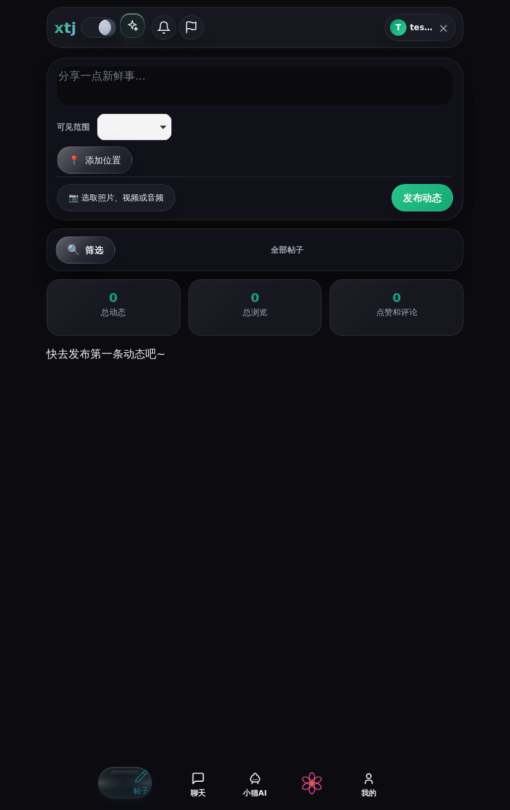
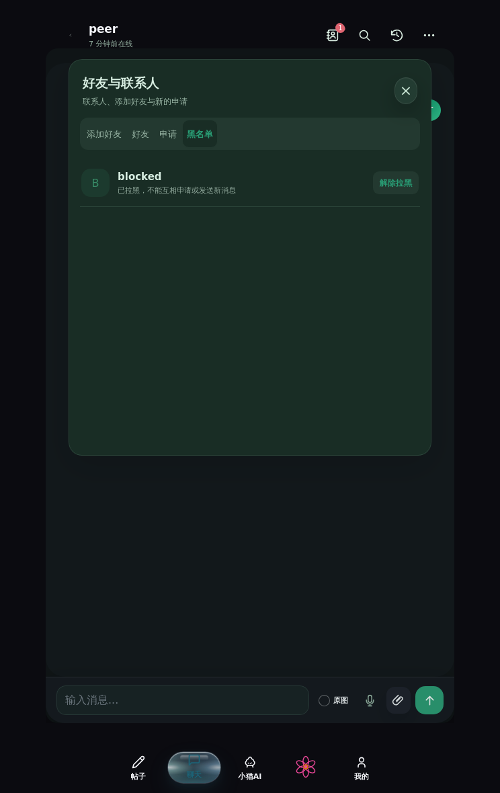

# 聊天与深色模式截图问题修复（2026-09-30）

本轮对应用户提供的四张截图，基于 main 的 91417d7 修复。用户明确允许调整底部 Dock 按钮之外的背景及点击区域；按钮、文字、胶囊、位置和导航结构保持原样。

## 修复

- **通讯录切换闪烁**：切换标签不再重播整个面板入场动画；好友、申请、黑名单缓存恢复原节点，重新请求得到相同内容时不重建列表或头像。变更后的数据仍会更新，迟到的响应不能覆盖当前标签。面板在两种主题中使用实色背景。
- **Dock 外层遮挡**：移除外层和伪元素的背景、阴影与模糊，外层 `pointer-events: none`；原有按钮继续独立接收点击。运行测试在其空白区域放置点赞按钮，验证可直接点击，同时验证聊天导航仍可用。
- **深色模式割裂**：补齐随主题切换的内容表面变量；手机和窄屏 iPad 上的顶部导航、统计卡片不再保留白色。覆盖 390、744、820px 触摸视口以及 iPhone/iPad 用户代理。
- **恢复旧主题按钮**：恢复历史提交 8246e41 的 `theme-toggle-orb/theme-toggle-core` 日月滑块，移除新 SVG 月亮。恢复 52×30px 尺寸，避免移动端通用圆形按钮规则裁切图标；主题切换使用短淡入淡出，连点不会启动并发过渡，尊重减少动态效果设置。
- **麦克风不能启用**：生产与本地共用的 HTTP `Permissions-Policy` 原先包含 `microphone=()`，禁止网页录音。改为 `microphone=(self)`，相机策略维持禁用。录音器遇到已声明支持却无法构建的格式会尝试其他格式和浏览器原生默认格式；权限拒绝、无设备及占用分别提示原因，取消录音恢复按钮样式。

## 验证

- Node 完整回归：847/847；补充资源与功能检查：99/99。
- 最终 Chromium 浏览器：37/37。
- 最终 Linux WebKit：35 通过、2 能力跳过（原生 MediaRecorder 和麦克风设备不可用）。
- 原生 Chromium 使用模拟麦克风设备，验证真实 HTTP 策略、点击录音、长按录音及取消；负向对照使用旧策略，确认 `getUserMedia` 返回 `NotAllowedError`。
- 只读验收脚本 `scripts/check-live-microphone.js`：本地真实服务生成 17,070 字节 WebM 录音，媒体轨道处于 live 状态。脚本不创建账号、不上传、不写数据库；部署后可在生产 URL 再运行。
- JS 语法检查、生产构建、压缩资源哈希、构建一致性与 `git diff --check` 通过。

## 截图

以下为 WebKit 云端截图，使用测试数据；不代表实体 iPhone/iPad 的硬件录音验收。

## 验收边界

实体 iPhone/iPad Safari 的麦克风、音频输出路由和系统权限弹窗仍需真机验收。异步转写仍受服务器转写服务配置限制，本轮未声称该配置已启用。
