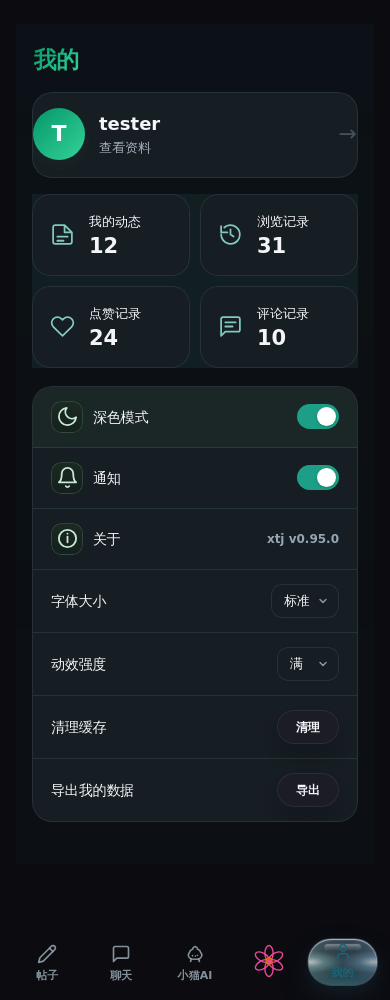
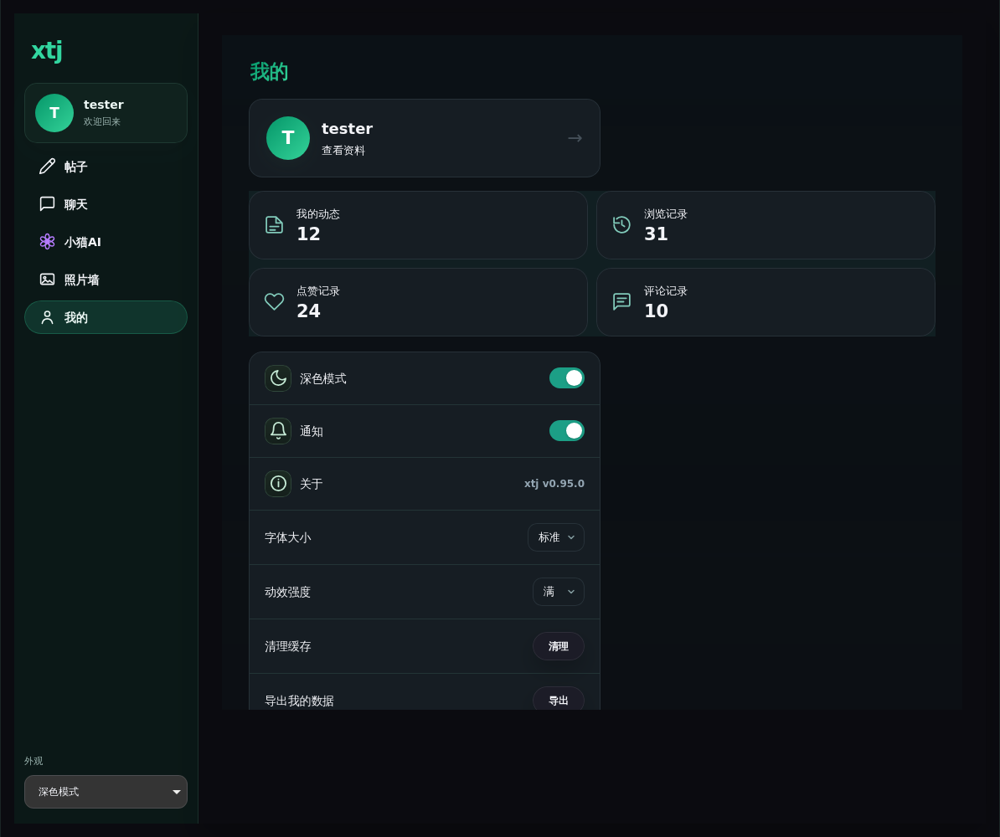

# 2026-09-30 v0.95.0 交付与验证

本轮基于 `551a63096565727a5985b606270d0dba0a80513b`，包含语音修复、太阳／月亮、Code 退役、四类个人记录和个人页排版。详细产品决定见 [维护说明](current-product-decisions.md)。

## 修复与验证

- 在申请录音权限前切到 `play-and-record`，结束／取消恢复 `auto`。运行用例复现 playback 状态下的 WebKit InvalidStateError，并覆盖连续录音、取消后再录、长按与原生假麦克风入口。
- 录音 stop 生成完整文件；发送保存校验后的时长，保持即时波形气泡。增加合成 AAC/MP4 文件的真实播放、时间推进验证，不使用任何用户录音作为测试素材。
- 播放权限拒绝不刷新地址；其他错误认证刷新当前气泡。服务端先核对会话与消息可见性，对清空、个人隐藏和删除会话均拒绝签名。
- 四类个人记录由当前签名身份查询，限页大小、时间/id 游标。运行验证账户隔离、私密内容保护、同时间翻页、无效游标和数据库失败。
- Code 专属页面、入口、资源与接口均移除。退役回归确认普通 AI 与深度思考保留。
- Chromium / WebKit 检查 390、744、1194 px 个人页面，四卡高度 82px，头像正圆，无横向溢出；检查记录翻页、深色原生下拉框、太阳／月亮及旧聊天交互。
- `npm test`：843 个 Node 用例及 99 个补充检查通过。构建、语法、产物一致性及 diff 检查通过。
- 浏览器覆盖 43 个用例：Chromium 42 通过、1 AAC 编码能力跳过；WebKit 41 通过、2 原生麦克风／MediaRecorder 能力跳过。AAC 真实播放由 WebKit 执行；最终关键 WebKit 复测 7/7 通过。

## 页面截图

## 仍需真机验收

云端测试包含合成音轨、假设备、桌面 Chromium 和 Linux WebKit，不代替物理 iPhone/iPad Safari 的麦克风、扬声器路由及真实双设备联机验收。这两项仍应保留在后续验收中，不能记为已经通过。
